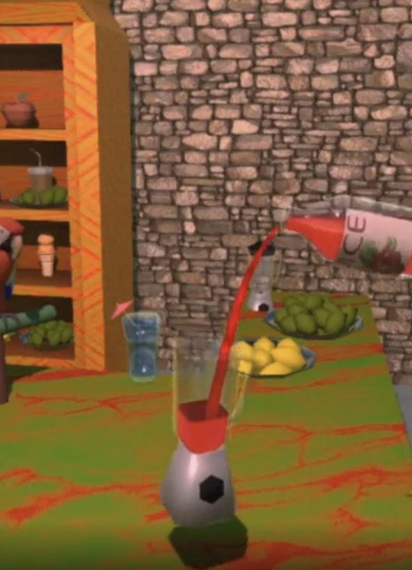

# CloudyDragon

## Audio Implementation (Unity)

Gameplay-driven pouring interaction with state-based audio playback and
tilt-controlled intensity.

### Demo Video

https://youtu.be/8yG6OPKkfcU?si=wbRIcolut3RUqqrs

### Interaction Preview



### Code Example (LiquidPourer.cs)

```csharp
public void StartPouring()
{
    if (!Particle.isPlaying)
        Particle.Play();

    pourAudio?.StartLoop();
}

void UpdatePourAudio()
{
    float tiltAmount = Mathf.Clamp01(-transform.up.y);
    pourAudio?.SetIntensity(tiltAmount);
}

public void StopPouring()
{
    Particle.Stop();
    pourAudio?.StopLoop();
}
